# Testwale — Code Wiki

## 1) Project Overview

Testwale is a Next.js (App Router) web application for exam preparation. It provides:

- A landing/home experience with subject shortcuts and search.
- Practice flows that fetch topics/questions from a backend API.
- A “History” section that lists topics and runs a topic-specific practice flow.
- A “Quiz” flow that runs a timed quiz backed by a local JSON question bank.
- Basic bilingual support (English + Hindi).

The repository contains multiple “data backend” approaches (Supabase, MongoDB, MongoDB Atlas Data API). The active runtime backend for the Next.js API routes is Supabase, while MongoDB-related code is currently used mainly in scripts and models (see “Data Layer”).

## 2) Tech Stack

- Framework: Next.js 14 App Router ([next.config.mjs](file:///c:/Users/balis/Downloads/testwale/next.config.mjs))
- Language: TypeScript ([tsconfig.json](file:///c:/Users/balis/Downloads/testwale/tsconfig.json))
- UI: React 18
- Styling: Tailwind CSS ([tailwind.config.ts](file:///c:/Users/balis/Downloads/testwale/tailwind.config.ts), [app/globals.css](file:///c:/Users/balis/Downloads/testwale/app/globals.css))
- Data access:
  - Supabase client ([lib/supabase.ts](file:///c:/Users/balis/Downloads/testwale/lib/supabase.ts)) used by Next.js route handlers
  - MongoDB driver + Mongoose models present (see “Data Layer”)
- Icons: lucide-react

## 3) Repository Layout

Top-level structure (key folders/files):

- [app/](file:///c:/Users/balis/Downloads/testwale/app) — Next.js App Router pages, API route handlers, and UI components.
  - [app/api/](file:///c:/Users/balis/Downloads/testwale/app/api) — Server route handlers used by the UI.
  - [app/components/](file:///c:/Users/balis/Downloads/testwale/app/components) — Client UI building blocks.
  - [app/actions/](file:///c:/Users/balis/Downloads/testwale/app/actions) — “server actions” types/exports.
  - [app/lib/](file:///c:/Users/balis/Downloads/testwale/app/lib) — Client-side language/translation helpers (note: duplicated with root `lib/`).
- [lib/](file:///c:/Users/balis/Downloads/testwale/lib) — Shared libraries (Supabase, MongoDB Data API, language context/translation).
- [models/](file:///c:/Users/balis/Downloads/testwale/models) — Mongoose schemas (Question + HistoryQuestion).
- [data/questions.json](file:///c:/Users/balis/Downloads/testwale/data/questions.json) — Local question bank used by `/questions/*` and `/quiz/*`.
- [scripts/](file:///c:/Users/balis/Downloads/testwale/scripts) — Utility scripts (Supabase debug, Mongo connectivity tests, DB cleanup).
- [package.json](file:///c:/Users/balis/Downloads/testwale/package.json) — npm scripts and dependencies.

## 4) Runtime Architecture (High-Level)

### 4.1 Request/Response flow

The UI is rendered by Next.js pages under `app/`. These pages call internal API endpoints under `app/api/`.

```mermaid
flowchart LR
  Browser[Browser] -->|HTTP| Next[Next.js App Router]
  Next --> Pages[app/* pages]
  Pages -->|fetch('/api/...')| Api[app/api/* route handlers]
  Api --> Supabase[Supabase: history_questions table]
  Pages --> LocalJson[data/questions.json]
```

### 4.2 Key user journeys

- Home (`/`): landing + subject cards + search input.
- Practice (`/practice`): loads topics, then loads questions, filters by selected topic.
- History topics (`/history`): lists topics from `/api/history/topics`.
- History quiz (`/history/[topic]`): loads all questions, then filters by URL topic.
- Subject bank (`/questions/[subject]`): lists questions from local JSON, starts quiz per question.
- Quiz (`/quiz/[id]`): timed question UI from local JSON.

## 5) Major Modules and Responsibilities

### 5.1 App Shell

- Root layout: [RootLayout](file:///c:/Users/balis/Downloads/testwale/app/layout.tsx#L15-L25)
  - Loads fonts (Inter + Lora).
  - Wraps the app in a LanguageProvider (currently imported from root [lib/LanguageContext.tsx](file:///c:/Users/balis/Downloads/testwale/lib/LanguageContext.tsx)).

### 5.2 Pages (Routes)

- Home page: [HomePage](file:///c:/Users/balis/Downloads/testwale/app/page.tsx)
  - Search redirects to `/practice?search=...` (the search parameter is not currently used by the practice page).
  - Shows curated “subjects” cards that link to `/practice?subject=...` (the subject parameter is not currently used by the practice page).

- Practice page: [Practice](file:///c:/Users/balis/Downloads/testwale/app/practice/page.tsx)
  - Calls:
    - `GET /api/topics` to list topics.
    - `GET /api/questions` to get questions, then filters client-side by topic.
  - Renders:
    - [TopicCard](file:///c:/Users/balis/Downloads/testwale/app/components/TopicCard.tsx) for topic selection.
    - [QuestionCard](file:///c:/Users/balis/Downloads/testwale/app/components/QuestionCard.tsx) for interactive practice.

- History topics page: [HistoryPage](file:///c:/Users/balis/Downloads/testwale/app/history/page.tsx)
  - Calls `GET /api/history/topics` and links each topic to `/history/[topic]`.

- History quiz page: [HistoryQuiz](file:///c:/Users/balis/Downloads/testwale/app/history/%5Btopic%5D/page.tsx)
  - Calls `GET /api/questions` and filters client-side by `params.topic`.

- Subject bank: [SubjectPage](file:///c:/Users/balis/Downloads/testwale/app/questions/%5Bsubject%5D/page.tsx)
  - Uses [data/questions.json](file:///c:/Users/balis/Downloads/testwale/data/questions.json) as a local question bank.
  - Links each item to `/quiz/[id]`.

- Quiz page: [QuizPage](file:///c:/Users/balis/Downloads/testwale/app/quiz/%5Bid%5D/page.tsx)
  - Loads a single question from local JSON by `id`.
  - Implements a countdown timer and “Check Answer” UI.

- Contact page: [ContactPage](file:///c:/Users/balis/Downloads/testwale/app/contact/page.tsx)
  - Pure client-side form placeholder (currently logs submitted values to console).

### 5.3 API Routes (Server)

All API routes are Next.js Route Handlers under `app/api/**/route.ts`. They are invoked by client pages using `fetch('/api/...')`.

- `GET /api/questions`: [app/api/questions/route.ts](file:///c:/Users/balis/Downloads/testwale/app/api/questions/route.ts)
  - Reads all rows from Supabase table `history_questions`.
  - Adds `id` fallback if row is missing an id.
  - Returns `{ questions }` with `Cache-Control: no-store`.

- `GET /api/topics`: [app/api/topics/route.ts](file:///c:/Users/balis/Downloads/testwale/app/api/topics/route.ts)
  - Reads `topic` column from `history_questions`.
  - Returns unique topics as `{ topics: Array<{en,hi}> }`.

- `GET /api/history/topics`: [app/api/history/topics/route.ts](file:///c:/Users/balis/Downloads/testwale/app/api/history/topics/route.ts)
  - Similar to `/api/topics`, but normalizes `topic` into a string (either string topic or `topic.en/topic.hi`).
  - Returns `{ topics: string[] }`.

- `GET /api/history/questions?topic=...`: [app/api/history/questions/route.ts](file:///c:/Users/balis/Downloads/testwale/app/api/history/questions/route.ts)
  - Requires `topic` query param.
  - Uses a Supabase filter on JSON fields `topic->>en` or `topic->>hi` using case-insensitive `ilike`.
  - Returns `{ questions }`.

### 5.4 UI Components

- Navbar: [Navbar](file:///c:/Users/balis/Downloads/testwale/app/components/Navbar.tsx)
  - Renders navigation links, language toggles, and a search form (pushes to `/practice?search=...`).

- Practice question card: [QuestionCard](file:///c:/Users/balis/Downloads/testwale/app/components/QuestionCard.tsx)
  - Renders question text and options.
  - Tracks selected option locally and reveals explanation.
  - Expects bilingual fields in question payload: `{ en, hi }`.

- Topic card: [TopicCard](file:///c:/Users/balis/Downloads/testwale/app/components/TopicCard.tsx)
  - Renders a topic selector tile for bilingual topic names.

- Topic selector (unused): [TopicSelector](file:///c:/Users/balis/Downloads/testwale/app/components/TopicSelector.tsx)
  - Renders a pill-style topic filter bar for a chosen subject.

### 5.5 Localization (Language + Translations)

There are currently two separate localization implementations:

- Root `lib/`:
  - Language context: [lib/LanguageContext.tsx](file:///c:/Users/balis/Downloads/testwale/lib/LanguageContext.tsx)
  - Translations: [lib/translations.ts](file:///c:/Users/balis/Downloads/testwale/lib/translations.ts) (flat keys under `en`/`hi`)

- App `app/lib/`:
  - Language context: [app/lib/LanguageContext.tsx](file:///c:/Users/balis/Downloads/testwale/app/lib/LanguageContext.tsx)
  - Translations: [app/lib/translations.ts](file:///c:/Users/balis/Downloads/testwale/app/lib/translations.ts) (nested object + `t(key, lang)` helper)

For correct runtime behavior, pages and components must import the same context provider instance as the one used in `RootLayout`.

## 6) Data Layer

### 6.1 Active runtime data source: Supabase

The Next.js API route handlers import the Supabase client:

- [lib/supabase.ts](file:///c:/Users/balis/Downloads/testwale/lib/supabase.ts)
  - Reads environment variables `SUPABASE_URL` and `SUPABASE_KEY`.
  - Creates a Supabase JS client with `persistSession: false`.
  - Throws an Error at import-time if env vars are missing (this affects local dev and builds).

Supabase table referenced:

- `history_questions` (selected columns vary by route; often `*` or `topic`)

Expected row shape (inferred from usage + models):

- `id: string`
- `exam?: string`
- `askedIn: string`
- `subject: string`
- `topic: { en: string; hi: string } | string`
- `question: { en: string; hi: string }`
- `options: Record<string, { en: string; hi: string }> | { en: string[]; hi: string[] }`
- `answer: string` (e.g., "A", "B", ...)
- `explanation: { en: string; hi: string }`

### 6.2 Local JSON question bank

Local static question data lives in [data/questions.json](file:///c:/Users/balis/Downloads/testwale/data/questions.json) and is used by:

- [SubjectPage](file:///c:/Users/balis/Downloads/testwale/app/questions/%5Bsubject%5D/page.tsx)
- [QuizPage](file:///c:/Users/balis/Downloads/testwale/app/quiz/%5Bid%5D/page.tsx)

### 6.3 MongoDB and Mongoose (present, likely legacy/experimental)

Mongoose models exist:

- [models/Question.ts](file:///c:/Users/balis/Downloads/testwale/models/Question.ts)
- [models/HistoryQuestion.ts](file:///c:/Users/balis/Downloads/testwale/models/HistoryQuestion.ts)

MongoDB scripts exist:

- [scripts/clearDatabase.js](file:///c:/Users/balis/Downloads/testwale/scripts/clearDatabase.js) (npm script: `npm run clear-db`)
- [scripts/testMongoFallback.js](file:///c:/Users/balis/Downloads/testwale/scripts/testMongoFallback.js) and others for connectivity diagnostics

MongoDB Atlas Data API helper exists but is not referenced elsewhere:

- [lib/dataApi.ts](file:///c:/Users/balis/Downloads/testwale/lib/dataApi.ts)
  - `findDocuments(options)`
  - `insertDocument(database, collection, document)`

## 7) Dependency Relationships (Module-Level)

```mermaid
flowchart TB
  Layout[app/layout.tsx] --> LangRoot[lib/LanguageContext.tsx]
  Layout --> GlobalCss[app/globals.css]

  Home[app/page.tsx] --> Navbar[app/components/Navbar.tsx]
  Navbar --> LangRoot
  Navbar --> TransRoot[lib/translations.ts]

  Practice[app/practice/page.tsx] --> TopicCard[app/components/TopicCard.tsx]
  Practice --> QuestionCard[app/components/QuestionCard.tsx]
  Practice --> LangApp[app/lib/LanguageContext.tsx]
  Practice --> TransApp[app/lib/translations.ts]

  QuestionCard --> TransApp

  ApiQuestions[app/api/questions/route.ts] --> Supa[lib/supabase.ts]
  ApiTopics[app/api/topics/route.ts] --> Supa
  ApiHistTopics[app/api/history/topics/route.ts] --> Supa
  ApiHistQuestions[app/api/history/questions/route.ts] --> Supa

  Quiz[app/quiz/%5Bid%5D/page.tsx] --> LocalJson[data/questions.json]
  Subject[app/questions/%5Bsubject%5D/page.tsx] --> LocalJson

  Scripts[scripts/*] --> Mongo[mongodb driver]
  Models[models/*] --> Mongoose[mongoose]
```



## 8) How to Run

### 8.1 Prerequisites

- Node.js and npm installed locally (the current environment may not include Node by default).
- A Supabase project with a table named `history_questions` (or adjust API routes accordingly).

### 8.2 Install

```bash
npm install
```

### 8.3 Environment variables

Create a `.env.local` file in the repository root with:

```bash
SUPABASE_URL=...
SUPABASE_KEY=...
```

Optional (only for MongoDB scripts / non-Supabase flows):

```bash
MONGODB_URI=...
MONGODB_DIRECT_URI=...
MONGODB_DATA_API_URL=...
MONGODB_DATA_API_KEY=...
```

### 8.4 Run locally

```bash
npm run dev
```

Then open http://localhost:3000

### 8.5 Build and start

```bash
npm run build
npm run start
```

### 8.6 Useful scripts

- Clear MongoDB `testwale_db.questions` collection:

```bash
npm run clear-db
```

## 9) Known Inconsistencies / Tech Debt (Observed)

- Mixed localization implementations:
  - Root layout uses [lib/LanguageContext.tsx](file:///c:/Users/balis/Downloads/testwale/lib/LanguageContext.tsx), while several pages import [app/lib/LanguageContext.tsx](file:///c:/Users/balis/Downloads/testwale/app/lib/LanguageContext.tsx). This can cause runtime errors (“useLanguage must be used within a LanguageProvider”) when contexts don’t match.
  - Home + Navbar import [lib/translations.ts](file:///c:/Users/balis/Downloads/testwale/lib/translations.ts) but access translations as nested keys (e.g. `"hero.badge"` via dot traversal), which does not match the actual shape of that file (it is `translations.en['hero.badge']` style). This likely renders empty strings.

- Practice/History question filtering:
  - `/practice` and `/history/[topic]` load all questions via `/api/questions` and filter client-side. For large datasets, server-side filtering (similar to `/api/history/questions?topic=...`) is more efficient.

- Option count mismatch:
  - Local JSON uses options A–E in places; [QuestionCard](file:///c:/Users/balis/Downloads/testwale/app/components/QuestionCard.tsx) currently labels options with A–D only (`optionLabels = ['A','B','C','D']`), which can hide option E if the data includes it.

- Navigation links in Navbar point to pages that are not present in `app/` (e.g. `/subjects`, `/about`, `/pyq`). These routes will 404 unless added later.

## 10) Quick Reference: Key Files

- App routes: [app/](file:///c:/Users/balis/Downloads/testwale/app)
- API routes: [app/api/](file:///c:/Users/balis/Downloads/testwale/app/api)
- Supabase client: [lib/supabase.ts](file:///c:/Users/balis/Downloads/testwale/lib/supabase.ts)
- Question types/schema: [models/Question.ts](file:///c:/Users/balis/Downloads/testwale/models/Question.ts)
- Local question bank: [data/questions.json](file:///c:/Users/balis/Downloads/testwale/data/questions.json)
- Build config: [package.json](file:///c:/Users/balis/Downloads/testwale/package.json), [next.config.mjs](file:///c:/Users/balis/Downloads/testwale/next.config.mjs)

